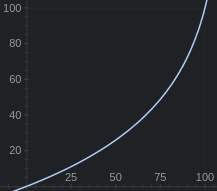

# Volume
This basically changes amixer volume with a different formula that makes the sensibility feel correct.

It just has it's own internal volume and then applies the following formula to transform it into amixer values.

$$ y = -log10(-(x/100)*0.9+1)*100 $$

*0.9%2B1)*100)

Plain text: `y` = -log10(-(`x`/100)\*0.9+1)\*100

Where `y` is the amixer output value and `x` is the input value, this makes changes in low volumes more small and in high volumes bigger.

# Usage
This script takes 1 argument required or 2 optional.
* 1 arg: change the volume by that number in left and right sides
* 2 arg: change the volume by that number, but the first argument is for the left side and the second for the right side

# Note
* This script saves volumes at `~/.config/user/volume/{lft,rgt}` files, you will have to create them or change the path
* This script uses the following commands that I consider that most of them are built-ins or should come installed by default, but anyways I'll list them here:
  * pidof
  * sed
  * sleep
  * bc
  * awk
  * amixer

# Tips
* To get the current volume you can just `volume 0`;
* To set the volume to a specific value you can `volume -100` and then `volume <you_number>` I want to properly implement this
